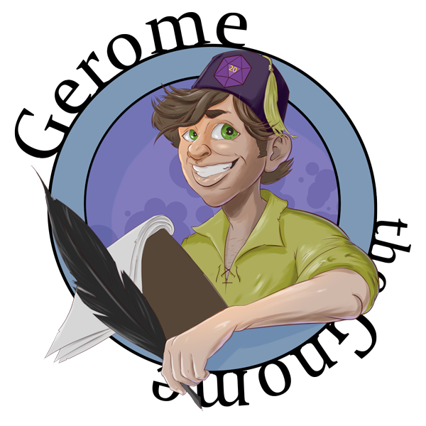

#   
livesite: https://gerome-the-gnome.herokuapp.com/  

### Authors: 
Sean Morgan  
github: https://github.com/insideseanshead/  

David Guthmann  
github: https://github.com/Dguthmann/  

Wesley McMillan  
github: https://github.com/wmcmillan/  

Ismahan Jamea  
github: https://github.com/ismahanj/  

Jose Morales  
github: https://github.com/jmoarles072095/

## List of Contents

server.js  
package.json  
README.md  
LICENSE  
### config  
config.json  
### controllers  
character-controller.js  
html-contoller.js  
### db  
schema.sql  
seeds.js  
### models  
character.js  
class.js  
index.js  
instance.js  
race.js  
save.js  
user.js  
### public\assets  
#### css  
style.css
#### images  
dice.png  
gerome-log_header.png  
gerome-log_readme.png  
#### js  
script.js  
### views
allChar.handlebars  
create.handlebars  
createwith.handlebars  
edit.handlebars  
index.handlebars  
search.handlebars  

## Installation
you will need the following additional npms to run this project:  
express  
express-handlebars  
mysql2  
nomina  
sequelize  
trpg-dice  
handlebars-helper-css (for further development)

## Basic Overview of Project
For the game master who needs an innkeeper, city guard, or any number of townfolk.  Tired of kings named Bob or liches naemed Geoff?  Then Gerome the Gnome is here for you.  With a couple clicks you will have access to a wide variety of characters to populate your next game.

## User Stories
AS A person who cannot think of quick non-player character names  
I WANT want a tool to give me unique and memorable npcs  
AS A person wanting to remember the npc's relationship to the party  
I WANT to be able to maintain notes needed for roleplay  
SO THAT I can react appropriately to the party's presence  
AS A person who making npc interactions with the party  
I WANT to be able have access to npc's modifiers for interaction checks  
SO THAT I can run the game smoothly  

## Website Features

  

  

## Resources Used

Zachary Stowell for help many to one relationships and the add FK id for post requests.  
Wesley Clements for help with partials in handlebars.  
Denis Molloy help with debugging search page locking up on loading.  
Aslan Ghodsian Helped with the seeding of the live database.

## Further Development Plans

User authentication so that way the user has complete control over notes added to a character and deleting a character. The addition of more races such as gnome, dragonborn, half-elf, half-orce, and tiefling.  The addition of more classes such as commoner, guard , noble, and veteran.  User ability to edit character name.  Adding of saving throws row based on class.

## Changelog

2020-10-26: Create Gerome-the-Gnome art assets,  Bug fixing of search page, character partials include race and class type,  Nav bar styling, website gif highlights.  

2020-10-24: Fix script.js to route with backend and debug, front end controller created for webpage generation, character controller put and delete requests added.  

2020-10-23: Adding racial bonuses for character creation, css styling of all pages, adding racial bonuses to stats generation, character create functionality started.  

2020-10-22: All characters handlebar page, create script.js file for front end, handlebars card element built, character-contoller set up, main stat functionality for assigning rolls, search page handlebars created, random name generation functionality added.  

2020-10-21: Insert seed race data, class seed data, server.js set up, controller folder, creation of html page form.  

2020-10-20: Set up base suite of npm packages, README formatted, name.js model, schema created, make public folder, race.js model, view folder, class.js model.  

2020-10-19: Brainstorming session to determine gerome the gnome.  Pitch presentation documents created: Slideshow, table structure, kanban board.  